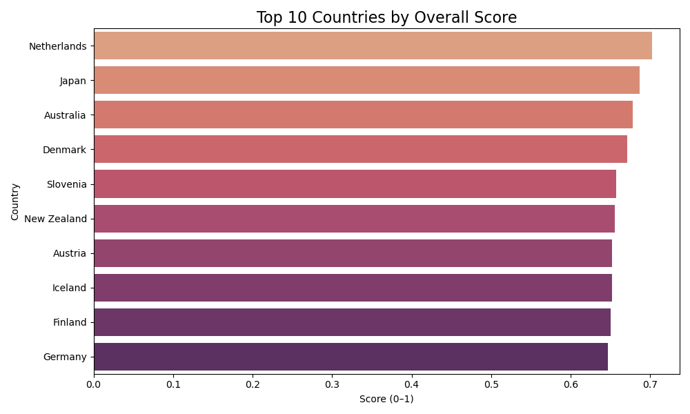

# Country Analysis & Scoring

This project compares countries across nearly 40 features related to quality of life, economy, demographics, and several other metrics. I then attempt to create my own boiled down Quality of Life score using some of the most important features present in this dataset. This project showcases my skills in SQL, Excel, Python, and Tableau, using real-world data to rank nations more holistically than standard indexes.

## Project Overview

Three datasets were initially taken from Kaggle, but only two were used in the final analysis. These two were cleaned, transformed, and merged using SQL, then modified slightly in Excel before being analyzed in Python using Jupyter Notebooks. A scoring system was created to compare countries across finances, health, safety, environment, education, and opportunity, from which a Top 10 list was created. 

This data was also visualized using Tableau, creating an interactive dashboard showcasing the top 10 countries in each metric as well as all metrics for each individual country.

Data Sources:
- `world-data-2023.csv` (economic + social indicators)
- `Quality_of_Life.csv` (Numbeo-style subjective indices)
- `world_rankings.csv` (discarded due to immensity)

## Goals

- Clean data and reorganize into proper database structure format.
- Then merge multiple global datasets into a single, analysis-ready table.
- Explore economic, demographic, and statistical trends across nations.
- Create a custom quality of life ranking system based on multiple value areas.
- Visualize data with Python and Tableau.

## Sample Visualizations

### Top 10 Country Rankings

### Adjusted Score vs Quality of Life Index

## Key Insights

- Wealth and quality of life don’t always align. Some high-GDP countries scored poorly.
- Certain regions performed better than others in terms of Quality of Life value, with European, North American, and East Asian countries topping the list.
- Financial data had a huge impact on my Quality of Life score, particularly in terms of lowering or balancing the score. Countries with missing Financial Data had higher Adjusted Overall Scores.
- Jupyter Notebook’s data cleaning power wipes the floor with SQL. Much time was lost.

## Skills Demonstrated

- SQL: Data cleaning, joins, NULL handling, type conversion, and database normalization.
- Python: Exploratory Data Analysis with Pandas, Matplotlib, and Seaborn.
- Excel: Minor modifications and quality checks.
- Tableau: Geographic dashboards and comparative bar charts.

## Future Improvements

- Refine scoring model with better weighting.
- Expand to historical or real-time data sources.
- Add clustering for regional or economic similarities.
- Draw greater comparisons between metrics.

## Built With

- MySQL Workbench
- Python, Pandas, Matplotlib, Seaborn
- Jupyter Notebooks
- Excel
- Tableau (external)

## Contact
Feel free to reach out or connect:
- Derek Emerson
- derekwemerson@gmail.com
- [linkedIn.com/in/derekwemerson](https://www.linkedin.com/in/derekwemerson/)
